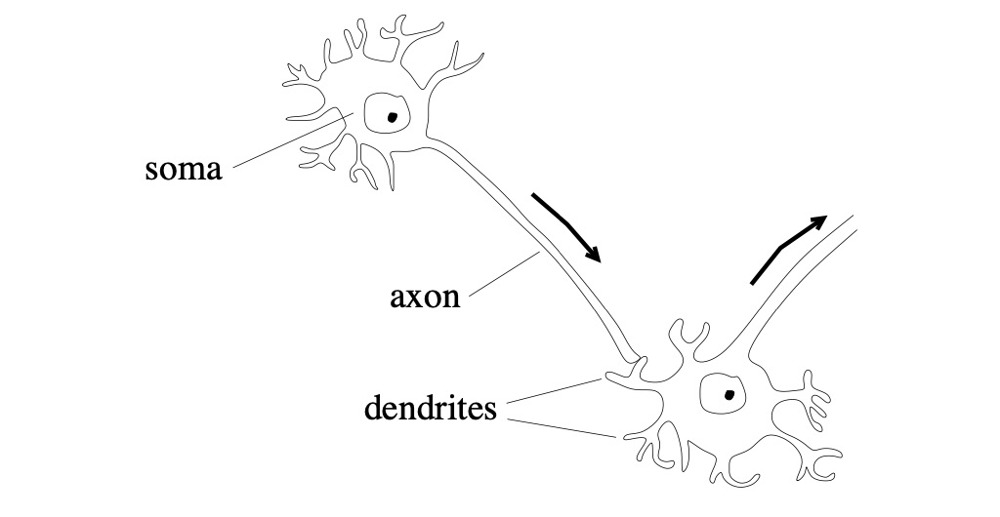
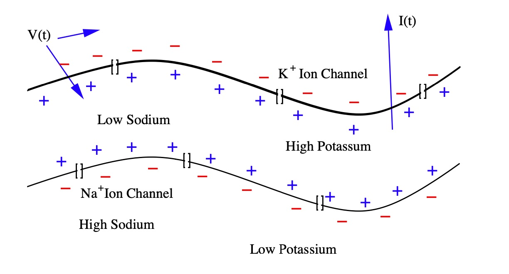
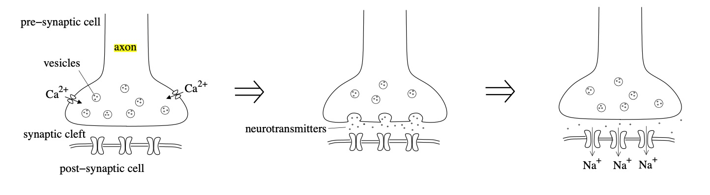

<script src="https://cdn.jsdelivr.net/gh/mathjax/MathJax-a11y/extensions/auto-collapse.js"></script>

<script src="https://cdn.jsdelivr.net/gh/mathjax/MathJax-a11y/extensions/collapsible.js"></script>

<script type="text/x-mathjax-config">
MathJax.Hub.Config({
 "HTML-CSS": { linebreaks: { automatic: true } },
         SVG: { linebreaks: { automatic: true } }
});
</script>


```{r, include=FALSE}
library(kableExtra)
library(phaseR)
library(deSolve)
library(graphics)
library(mathjaxr)
library(pagedown)
library(captioner)
library(latex2exp)
library(RColorBrewer)
library(knitr)
library(rmarkdown)
library(nat)
options(nat.plotengine = 'plotly')

knitr::opts_chunk$set(echo = FALSE, out.width = 400, fig.align = "center", fig.pos = 'default', fig.show = "hold", warning = FALSE, message = FALSE)

source(file = "colorCode.R")
```


## Introduction


The Wilson-Cowan model depicts a neuron population composed of an excitatory and an inhibitory subpopulation. Both of these subgroups represent large-scale neurons that exhibit various oscillation patterns when fired. The following is a background summary of neuron composition and structure. 


### Background

All cells have a charge difference across their entire membrane, and this difference generates potential energy of $V$. In most cell types, the resting potential is resistant to chaos. However, in some cell types (like neurons), variations in the cell's charge distribution can lead to large membrane potential changes. Such cells are called excitatory. Neurons use their excitable cell membranes to convey information. Each neuron cell contains a cell body called a somatic cell, a branching tree called a dendrite, and a single extension arm called an axon (Figure 1). Dendrites receive signals and integrate these signals into the body. When the incoming signals permit a response, a pulse generates in the soma's transmembrane voltage. This pulse is called an action potential, and it diffuses down the cell's axon and relays a signal to other neurons in the network.


```{r}
fig_nums <- captioner(prefix = "Figure")

neur_cap <- fig_nums(name = "neur_cap", caption = "Projecting from each cell’s body, called its soma, is a tree of dendrites and a long axon. Dendrites receive the signals sent down the axon.")
```


```{r, fig.cap = neur_cap, out.width="60%"}

```


The dendrites are an essential feature in coupling synaptic inputs and managing action potentials. The branch density and patterns of the dendrites (Figure 2) correlate to the neuron's function. In addition to a dendrite's unique morphology, dendritic branching is a reoccurring process where neurons form new dendritic trees and branches, which allow them to build new synapses.


```{r include=FALSE}
neur_cap2 <- fig_nums(name = "neur_cap2", caption = "A Single Neuron. Dendrites are branched extensions that can produce electrochemical simulations. The synapses distributed throughout the tree transmit electrical signals to the dendrites.")
```


```{r}
n = Cell07PNs[[1]]
df <- n$d

x1 <- df[df$PointNo %in% branchpoints(n),]
x2 <- df[df$PointNo %in% endpoints(n),]
x3 <- df[df$PointNo %in% n$StartPoint, ]
branch <- xyzmatrix(x1)
end <- xyzmatrix(x2)
soma <- xyzmatrix(x3)
```


```{r, fig.width=8, fig.height=6, fig.cap= neur_cap2, out.width="50%"}
plot(n, WithNodes = F, col = 'black', cex=2)
points(branch, col = colpal2[2], pch = 19, cex = 1.35)
points(end, col = colpal2[5], pch = 19, cex = 1.35)
points(soma, col = colpal2[9], pch = 19, cex = 1.35)
ex.cs1 <- expression(plain("branch points"),  paste("end points"), paste("the soma"))
legend(195,80, ex.cs1, pch = 21, cex = 0.85, pt.bg = c(colpal2[2], colpal2[5], colpal2[9]), title="Type of Nodes", title.col = "gray25", pt.cex = 1.5)
```


```{r}
#neur_cap3 <- fig_nums(name = "phase3", caption = "Dendrite Unique Morphology")
# jBrewColors <- brewer.pal(n=5 , name = "PuBuGn")
#plot(Cell07PNs[[1]], WithText=TRUE, col = "navy", lwd = 1, add=F, main=" ")
#plot(Cell07PNs[2:6], col = jBrewColors, lwd = 1, add=T)
```


#### Synaptic transmission


Postsynaptic Potentials, also called gradient potentials, are changes in the membrane potential of a chemical synapse. These potentials trigger or inhibit action potentials. Chemically-gated ion channels open on postsynaptic membranes, where sodium and potassium ions diffuse in the opposite directions. Postsynaptic receptors, located at chemical synapses, open ion channels and convert chemical signals into electrical signals. The following model describes the dynamics for the potential $\mathrm{V}\left(t\right)$ between the inside of the cell and outside of the cell for the membrane current $\mathrm{I}\left(t\right)$.

$$
\begin{align}
\mathrm{V}(t) \equiv V_\text{inside}(t) - V_\text{outside}(t), \\
\underbrace{\mathbf{I}(t)}_{\text{total}\\ \text{energy}} \equiv \underbrace{C \frac{d}{dt}\mathrm{V}(t)}_{\text{ganglion} \\ \text{energy} \\ \text{capacity}} + \underbrace{\mathrm{I}_i(t)}_{\text{real ion} \\ \text{flow}} 
\end{align}
$$ 


```{r}
neur_cap6 <- fig_nums(name = "neur_cap6", caption = "The myelin space on the axon has high-concentration ion channels, allowing nodes to regenerate the action potential. Positive ion current is directed from inside to outside.")
```


When an action potential reaches the axon, it activates calcium channels to induce an inrush of $\mathrm{Ca}^{2+}$ across the neuron cell's membrane (Figure 4). These calcium ions cause the release of signaling molecules called neurotransmitters that disperse through the synaptic cleft and attach to receptors on a cell's dendrites. The distance between the signaling cell's axon and the postsynaptic dendrite is the synaptic cleft. Neurotransmitter receptors on postsynaptic cells are converted into ion channels. When an electrical gradient triggers these neurotransmitter receptors, the receptor channel complexes cause the target cell's membrane excitation. In order to activate a sufficient number of these excitatory receptors, the action potential is activated in the cell and transmitted down its axon to the next cell.

```{r, fig.cap = neur_cap6, out.width="50%"}

``` 

In contrast, there are receptor channel complexes with inhibitory effects, in which ions flowing through the channel help restore the system to its resting potential. The assembly of these excitatory and inhibitory signals in the cell body allows various signaling behaviors. Additional diversity is exhibited by the receptor-channels' dynamic actions, which can respond to signals at different times and for different durations. 

Positive ion current directed from inside to outside defines a neuron's membrane current. Depending on how they affect the membrane potential, chemical synapses are either excitatory or inhibitory. The types and functions of these **excitatory and inhibitory** cells are the main topics we cover in this study. In the following, we further study these excitatory and inhibitory effects by analyzing Wilson and Cowan's dynamic, two-system equation, modeling the two neuronal populations.

```{r}
neur_cap4 <- fig_nums(name = "neur_cap4", caption = "When an action potential reaches the axon's edge, it triggers an inrush of calcium, causing neurotransmitters' release into the synaptic cleft. The neurotransmitters diffuse through the postsynaptic cell membrane and activate receptors, causing inward sodium currents.")
```

```{r, fig.cap = neur_cap4, out.width="70%"}

```


### Thesis and Preview


The Wilson-Cowan model represents the dynamics between the spatially confined excitatory and inhibitory subpopulations. Here, $E(t)$ and $I(t)$ denote the excitatory and inhibitory population's instantaneous discharge rate at time $t$, respectively. 


> a. Logistic Population Dynamics

The logistic growth model is commonly used in biology to model a population's growth under density dependence. The study assumes that the resting threshold $\theta$ is the same for all cells in the population. Hence, it holds that the sigmoid, logistic, response function $\mathcal{S}(x)$ is related to the distribution of synapses.


> b. Phase Plane Analysis, Steady-State Solutions, and Limit Cycles

Depending on the parameter values chosen, there may be either one, three, or five steady-state solutions to the system of equations. We define a stimulus configuration as any choice of constant values for external inputs $P$ and $Q$ and investigate necessary dynamical behavior based on relationships between the couplings $c_1, c_2, c_3, c_4$ and the sigmoid response parameters $a_e, a_i$ and $\theta_e, \theta_i$. 


----------------------------------------


## Model Population Dynamics

The logistic growth model is commonly used in biology to model a population's growth under density dependence. The study assumes that the resting threshold $\theta$ is the same for all cells in the population. Hence, it holds that the sigmoid, logistic, response function $\mathcal{S}(x)$ is related to the distribution of synapses. Here, $a$ and $\theta$ are parameters for the sigmoid function:

$$\small \mathcal{S}(x) = \frac{1}{1+\exp\left[-a(x-\theta)\right]}- \frac{1}{1+\exp\left({a\theta}\right)}.$$


### The Wilson-Cowan Model

The Wilson-Cowan model represents the dynamics between the spatially confined excitatory and inhibitory subpopulations. Here, $E(t)$ and $I(t)$ represent the instantaneous discharge rate of the excitatory and inhibitory population at time $t$, respectively. We define the variables characterizing the dynamics of a spatially localized neural population as the following.


$$
\begin{align}
\mathrm{E(t)} &= \text{proportion of excitatory cells firing per unit time } t, \tag{1} \\
\mathrm{I(t)} &= \text{proportion of inhibitory cells firing per unit time } t \tag{2}
\end{align}
$$


Now, we have the equations $E(t)$ and $I(t)$. We assume that the value of these functions at time $(t+\tau)$ will be equal to the proportion of cells, receiving at least threshold excitement at time $t$, that isn't sensitive (not refractory).


**Neuron Assumptions.** We are concerned with the behavior of the subpopulations rather than individual cells. Under the following assumptions, we may ignore random spatial interactions: 

<ol class="roundedlist">
1. Assume that the cells containing the two populations are very close in space.
2. Interconnections are arbitrary yet dense enough so that it is likely there's at least one path connecting any two cells in the population.
3. Neural processes depend on the interaction of excitatory and inhibitory cells.

</ol>

\ 


### Support Material 


#### 1. Proportion of Sensitive Cells in a Sub-population

First, the study obtained the independent expression of the proportion of sensitive cells and the proportion of cells that received at least a threshold stimulation. Relevant biologic assumptions assess when a neuron fires. Consequently, the most simple model must fulfill two **conditions**:

<ol class="roundedlist2">

1. The neuron should not be in its “refractory period,” meaning it can’t fire again immediately after having fired.
2. Neurons need to receive enough input in a short time.

</ol>

If the total refractory period has a duration of $r$ at time $t$, then the proportion of excitatory cells that are refractory will be given by the following:

$$
\begin{align}
\int^t_{t-r}{E(t^\prime) \; dt^\prime} \tag{3}
\end{align}
$$


Therefore, if $r$ is the length of the refractory period, the proportion of excitatory cells that are sensitive is the fraction of neurons that satisfy condition one at time $t$:


$$
\begin{align}
1- \int^t_{t-r}{E(t^\prime) \; dt^\prime} \tag{4}
\end{align}
$$

Similar expressions are obtained for the inhibitory subpopulation. We use the sigmoid response function to model population growth. The sigmoid, logistic growth model is commonly used in biology to model the growth of a population under density dependence. To represent neurons' nonlinear behavior, we use a sigmoid function $S(x)$, taken as characteristic of any subpopulation response function, dependent on two parameters $a$ and $\theta$:

$$
S(x) = \dfrac{1}{1 + e^{-a (x - \theta)}} \tag{5}
$$


The response function is sigmoidal if $S(x)$ monotonically increases on the interval (-$\infty$, +$\infty$), approaches the asymptotic states zero and one as $x$ approaches –$\infty$ and +$\infty$ respectively, and has one inflection point.

```{r}
neur_cap5 <- fig_nums(name = "neur_cap5", caption = "Sigmoid Subpopulation Response Function, with $\\theta=5$ and $a=1$.")
```


```{r, fig.cap=neur_cap5, out.width="60%"}
sigmoid = function(x,a,b) {
  1 / (1 + exp(-a*(x-b)))
}
x <- seq(-5, 5, 0.01)
plot(x, sigmoid(x, a=1, b=1), col=colpal2[8], ylab="Sigmoid Function", xlab="X")
grid()

```


To see if *condition 2* is fulfilled, we need the total input to the subpopulation to be a weighed contribution:

$$c_1 E(t) - c_2 I(t) + P(t)$$


We call $S_e$ the response function, also called the input-frequency characteristic of the excitatory neurons, and correspondingly $S_i$ for the inhibitory ones. A spike can still help eliciting a new spike in a downstream neuron even a few milliseconds later. The response functions give the expected proportion of those receiving at least threshold stimulation as a function of the population's average excitation levels. The sigmoid, nonlinear functions $S_e$, and $S_i$ take the form:


```{r NonLinFunctions}
# nonlinear functions
Se = function(x) {
  aE = 1.3
  thrE = 4
  sigmoid(x, thrE, aE) - sigmoid(0, thrE, aE)
}

Si= function(x){
  aI = 2
  thrI = 3.7
  sigmoid(x, thrI, aI) - sigmoid(0, thrI, aI)
}
```

```{r}
neur_cap6 <- fig_nums(name = "neur_cap6", caption = "Plot of the Sigmoid functions $S_e$ and $S_i$ for the excitatory and inhibitory subpopulations, respectively.")
```


```{r, fig.cap=neur_cap6, out.width="60%"}
y1 <- Se(x)
y2 <- Si(x)
## Not run: 
plot(x, y1, type = "l", col = colpal2[7], xlab = "", ylab = "", xlim=c(-2,5), lwd=3)
lines(x, y2, col = colpal2[10], lwd=3)
grid()
legend(-1,0.8, c(TeX("$S_{excitatory}$"),TeX("$S_{inhibitory}$")), lty = 1,lwd=4, col = c(colpal2[7], colpal2[10]), box.lwd = 0)
```


\ 

#### 2. Subpopulation Response Functions

If all cells receive same number of excitatory and inhibitory afferents, then the subpopulation response function $S(x)$ will take the form:

$$
\begin{align}
\mathcal{S}(x) & = \int^{x(t)}_0{D(\theta) \; d \theta} \tag{6}
\end{align}
$$


where $D(\theta)$ characterizes the distribution of individual neural thresholds. In other words, we assume that all cells in a subpopulation have the same threshold $\theta$ and that there is a combination of the number of afferent synapses per cell. Suppose $C(w)$ is the synapse distribution function, and $x(t)$ is the average excitation of each synapse. In that case, we expect all cells with at least $\theta$ $x(t)$ synapses to receive sufficient excitation.

If all cells within a subpopulation have the same threshold $\theta$, then the distribution of the number of afferent synapses per cell characterized by $C(w)$. Therefore, the subpopulation response function takes the following form:

$$
\begin{align}
\mathcal{S}(x) & = \int^{\infty}_{0\mid x(t)}{C(w) \; d w} \tag{6a}
\end{align}
$$


The study assumes that the resting threshold $\theta$ is the same for all cells in the population. Hence, it holds that the sigmoid response function is related to the distribution of synapses.


```{r}
functions <- data.frame("functions"= 
                          c("$\\bf \\mathcal{S}(x)$",
                            "$\\bf x(t)$",
                            "$\\bf D(\\theta)$",
                            "$\\bf C(w)$"
                            ),
                        "description" =
                          c("sigmoidal subpopulation response function",
                            "average level of excitation within a subpopulation",
                            "distribution of individual neural thresholds",
                            "distribution of the number of afferent synapses per cell"))
```


\ 


#### 3. Average Level of Excitation 

The inhibitory potential is when hyperpolarization brings about a net negative charge, so the potential is further away from zero. The excitation potential occurs during the depolarization process, so the potential is closer to the excitation threshold. Here is an expression for the average level of excitation generated in the cell at time $t$:


$$
\begin{align}
\int^t_{-\infty} \alpha \left(t-t^\prime \right) &\cdot \left[c_1E (t^\prime) - c_2I (t^\prime) + P(t^\prime)\right] dt^\prime
\end{align} \tag{7}
$$

Here, we define the parameters $c_1, c_2 \gt 0$ as the connection coefficients, representing the average number of excitatory and inhibitory synapses per cell. We denote $P(t)$ and $Q(t)$ as the external input of excitatory and inhibitory subgroups, respectively. The inhibitory subgroup will use similar expressions but with different coefficients and different external inputs. 


```{r, fig.height=4, fig.width=4}
parameters <- data.frame("parameters"= 
                           c("$\\bf c_1$",
                             "$\\bf c_2$",
                             "$\\bf c_3$",
                             "$\\bf c_4$",
                             "$\\bf P$", 
                             "$\\bf Q$"),
                         "description" = c(
                           "excitatory coupling constant\n applied to excitatory subpopulation",
                           "inhibitory coupling constant\n applied to excitatory subpopulation",
                           "excitatory coupling constant\n applied to inhibitory subpopulation",
                           "inhibitory coupling constant\n applied to inhibitory subpopulation",
                           "external input to excitatory cells",
                           "external input to inhibitory cells"
                           )
                         )
```


```{r, fig.height=4, fig.width=4}
knitr::kable(parameters,col.names = c("", ""), escape = F) %>%
  kable_styling(full_width = FALSE, font_size = 10, 
                html_font = "Frank-Ruhl-Libre", 
                bootstrap_options = c("striped", "hover")) %>% 
  column_spec(1, color = "white", 
              background = c(colpal2[2], colpal2[3], colpal2[4], colpal2[5], 
                             colpal2[6], colpal2[7])) %>%
  add_header_above(c("Table 1.1: Defining the System Parameters" = 2), 
                   align = "l", line = T)  %>%
  kable_paper()
```


\ 

The different coefficients reflect the difference in axon and dendritic geometry between excitatory and inhibitory cell types. In contrast, variations in external inputs assume the existence of cell types specific to the population. We can illustrate the diversity in axon and dendritic geometry between excitatory and inhibitory cell types by drawing several neurons, as shown below.


```{r}
body_cap4 <- fig_nums(name = "body_cap4", caption = "Axonal and Dendritic geometry. Plot of Several Neurons to illustrate the diversity in axonal and dendritic geometry between excitatory and inhibitory cell types.")
```


```{r, fig.width=7, fig.height=6, fig.show="hold", out.width="25%", fig.cap=body_cap4}
plot(Cell07PNs[1], col = colpal2[2], lwd=1.5)
plot(Cell07PNs[1:2], col = c(colpal2[2], colpal2[3]), lwd=1.5)
plot(Cell07PNs[1:10], col = c(colpal2[2], colpal2[3], colpal2[4],
                              colpal2[5], colpal2[6], colpal2[7],
                              colpal2[8], colpal2[9],colpal2[10],
                              colpal2[11]), lwd=1.5)
plot(Cell07PNs[1:20], col = c(colpal2[2], colpal2[3], colpal2[4],
                              colpal2[5], colpal2[6], colpal2[7],
                              colpal2[8], colpal2[9],colpal2[10],
                              colpal2[11], colpal2[12], colpal2[13],
                              colpal2[14], colpal2[15],colpal2[16],
                              colpal2[17], colpal2[18], colpal2[19],
                              colpal2[20], colpal2[1]), lwd=1.5, cex=0.88)
```


Overall, the dendrite branch structure is an essential feature in coupling synaptic inputs and managing action potentials in neurons. Each neuron has a unique branch density and pattern: this unique morphology correlates to the neuron's function.


```{r}
se <- function(x){
  ae=1.2
  theta_e=2.8
  1/(1+exp(-ae*(x-theta_e)))
}

si <- function(x){
  ai=1
  theta_i=4 
  1/(1+exp(-ai*(x-theta_i)))
}
```


\ 

#### 4. Equations for the activities E(t) and I(t)


Suppose the probability that a cell is sensitive is independent of the probability that a cell is excited above the threshold. In that case, we can define the excitatory subpopulation as the following equation:


$$
\begin{align*}
\left[{1-\int^t_{t-r}E(t^\prime) dt^\prime}\right]
\mathcal{S}_e(x) \delta t
\tag{8}
\end{align*}
$$


We designate this correlation between excitation and sensitivity by the following expression $\gamma \left[{\int^t_{t-r}E(t^\prime) \; dt^\prime,\mathcal{S}_e(x)}\right],$ so that the previous expression becomes:

$$
\small
\begin{align} 
\left[ 1-\int^t_{t-r}E(t^\prime) \; dt^\prime \right] & \\ 
\cdot  \, \mathcal{S}_e(x) & 
\left\{1-\gamma \left[{\int^t_{t-r}E(t^\prime) dt^\prime, \,
{\tiny\mathcal{S}_e(x)}}\right] \right \} \delta t
\end{align}
\tag{9}
$$


Due to fluctuations inherent in average excitation & cell thresholds, the parameter $\gamma$ is taken to be zero: $\gamma = 0$.

\ 


#### 5. Dynamics of a Localized Population of Neurons

It follows that the equations governing the dynamics of a localized population of neurons take the form of the following expressions:

$$
\small
\begin{align}
\mathbf{E}(t+\tau) \equiv& {\left[ 1-\int^t_{t-r}E(t^\prime) dt^\prime \right ]} \\
& \cdot \, \mathcal{S}_e
\left\{ \int^t_{-\infty} \alpha(t-t^\prime) 
[c_1 E(t^\prime) - c_2 I(t^\prime) + P(t^\prime)] dt^\prime \right\}, 
\end{align}\tag{10}
$$


$$
\small
\begin{align}
\mathbf{I}(t+\tau^{\prime}) \equiv & 
{\left[ 1 - \int^{t}_{t-r^{\prime}} I(t^\prime) dt^\prime \right ]} \\
& \cdot \, \mathcal{S}_i
\left\{ \int^t_{-\infty} \alpha(t - t^\prime) 
[c_3 E(t^\prime) - c_4 I(t^\prime) + Q(t^\prime)] dt^\prime  \right\}
\end{align}\tag{11}
$$

for the excitatory and inhibitory subpopulations. The parameters $\tau$ and $\tau^{\prime}$ represent the response delays, after which cells at time $t$ will be firing.


```{r fig.height=4, fig.width=4}
functions <- data.frame("functions"= 
                          c("$E(t)$",
                            "$I(t)$",
                            "$\\mathcal{S}_e(x)$",
                            "$\\mathcal{S}_i(x)$",
                            "$\\alpha(t-t^\\prime)$"
                            ),
                        "description" =
                          c("proportion of excitatory cells firing per unit time at $t$",
                            "proportion of inhibitory cells firing per unit time at $t$",
                            "sigmoidal response function for excitatory subpopulation",
                            "sigmoidal response functions for inhibitory subpopulation",
                            "stimulation decay function"))

```


```{r Table4, fig.height=4, fig.width=4}
knitr::kable(functions, col.names = c("", ""), escape = F) %>%
  kable_styling(full_width = FALSE, font_size = 10, html_font = "Frank-Ruhl-Libre", 
                bootstrap_options = c("striped", "hover")) %>% 
  column_spec(1, color = "white", 
              background = c(colpal2[2], colpal2[3], colpal2[4], colpal2[5], 
                             colpal2[6])) %>%
  add_header_above(c("Table 1.2: Defining the System Functions" = 2), 
                   align = "l", line = T)  %>%
  kable_paper()
```


\ 


#### 6. Time Coarse Graining

We are interested in the coarse-grained transitory behavior of the neural activity. Coarse-grained modeling aims to simulate the behavior of complex systems using simplified representations. In the above equation, we can get rid of the integral and multiply the stimulus by a constant describing the length of time influence. Consider the following application of time course-graining of equation E(t):

$$
\small
\begin{align}
\mathbf{E}(t+\tau) =& {\left[ 1-r\bar E(t)\right ]} \\
&\quad \cdot \, \mathcal{S}_e
\left[ {kc_1 \bar E - c_2 k \bar I + kP(t)} \right] , 
\end{align}
$$


Now, assuming that $\alpha(t-t^{\prime})$ decays exponentially and excludes inhibitory interactions, we extend the equation to the lowest term in $\tau$:

$$
\small
\begin{align}
\tau \frac{d \bar E}{dt} \equiv& -\bar E + \left[1-\int^t_{t-r}E(t^{\prime})dt^{\prime}\right] \\
& \cdot \mathcal{S}_e
\left\{ \int^t_{-\infty} e^{-\alpha(t-t^{\prime})} \left[c_1E(t^\prime) + P(t^\prime)\right]dt^\prime \right\}
\end{align}
$$


Now, we perform a Taylor series expansion about $\tau=0$, which is the retention of the linear term:


$$
\small
\begin{align}
\tau \frac{d \bar E}{dt} \equiv& -\bar E + (1-r \bar E) \mathcal{S}_e \left[{k c_1 \bar E - c_2k\bar{I}+kP(t)} \right]
\end{align}
$$


We can say that the activity at time $d + dt$ depends on the simultaneous satisfaction of conditions (1) and (2):

$$ 
\small
E(t + dt) = \left(1- rE\left(t\right)\right) S_e  \left(kc_1 E\left(t\right) - kc_2 I\left(t\right) + kP\left(t\right)\right).
$$


For physiological significant values of $\alpha$ and $r$, the course grained equations are valid.


---------------------------------------------------------------


### Transition and Connection
 
After the above reductions and assumptions, turning the original system in differential form and suitably rescaling $S_e$ and $S_i$, we reach a coupled, nonlinear, differential equation for the excitatory and inhibitory populations' firing rates.

$$
\begin{align}
\tau_e \frac{dE}{dt} = -E + (k_e - r_e E)  S_e (c_1 E - c_2 I + P) \\
\tau_i \frac{dI}{dt} = -I + (k_i - r_i I)  S_i (c_3 E - c_4 I + Q),
\end{align}
$$


where we define $\tau_e$ and $\tau_i$ as the time constants, $k_e$ and $k_i$ as the non-dimensional constants, $r_e$ and $r_i$ as the constants describing the length of the refractory periods, $S_e$ and $S_i$ as sigmoid functions representing the nonlinearity of the interactions, $c_{1,2,3,4}$ as the parameters representing the strength of the excitatory to inhibitory interactions, and $P$ and $Q$ as the external inputs to the excitatory and inhibitory populations respectively. 


```{r fig.height=4, fig.width=4}
parameters <- data.frame("parameters"= 
                           c("$\\bf c_1$",
                             "$\\bf c_2$",
                             "$\\bf c_3$",
                             "$\\bf c_4$",
                             "$\\bf P$", 
                             "$\\bf Q$",
                             "$\\bf k_e$",
                             "$\\bf k_i$",
                             "$\\bf \\tau_e$, 
                             $\\bf \\tau_i$",
                             "$\\bf r_e$",
                             "$\\bf r_i$"),
                         "description" = c(
                           "excitatory coupling constant\n applied to excitatory subpopulation",
                           "inhibitory coupling constant\n applied to excitatory subpopulation",
                           "excitatory coupling constant\n applied to inhibitory subpopulation",
                           "inhibitory coupling constant\n applied to inhibitory subpopulation",
                           "external input to excitatory cells",
                           "external input to inhibitory cells",
                           "non-dimensional constant for $\\mathcal{S}_e \\lt 1$",
                           "non-dimensional constant for $\\mathcal{S}_i \\lt 1$",
                           "time constants",
                           "refractory delay for excitatory subpopulation",
                           "refractory delay for inhibitory subpopulation"
                           )
                         )


```


```{r Table5, fig.height=4, fig.width=4}
knitr::kable(parameters, col.names = c("", ""), escape = F) %>%
  kable_styling(full_width = FALSE, font_size = 10, html_font = "Frank-Ruhl-Libre", 
                bootstrap_options = c("striped", "hover", "condensed"), 
                wraptable_width = 1) %>% 
  column_spec(1, color = "white", 
              background = c(colpal2[2], colpal2[3], colpal2[4], colpal2[5], 
                             colpal2[6], colpal2[7], colpal2[8], colpal2[9], 
                             colpal2[10], colpal2[11], colpal2[12])) %>%
  add_header_above(c("Table 1.3: Defining the System Parameters" = 2), 
                   align = "l", line = T)  %>%
  kable_paper()
```


\ 


**The System's Resting State.** The point $(E=0, I=0)$ is the system's resting state, which we require to be a stable fixed point. The resting state's mathematical result is that $E=0, I=0$ must be a steady-state solution for $P(t)=Q(t)=0$, i.e., in the vacancy of external inputs. This can be accomplished by transforming $S_e$ and $S_i$ so that $S_e(0)=0$ and $S_i(0)=0$. Thus, we subtract $S(0)$ from the original function. We have that the maximum values of $S_e$ and $S_i$ are less than 1, which we denote as $k_e$ and $k_i$. Furthermore, the resting state must be stable to be of physiological significance.

$$
\begin{align}
\tau_e\frac{dE}{dt} &= -E + (k_e - r_e E)S_e(c_1 E - c_2 I + P),\tag{12} \\
\tau_i\frac{dI}{dt} &= -I + (k_i - r_i I)S_i(c_3 E - c_4 I + Q) \tag{13}
\end{align}
$$


We can write the equations for the nullclines corresponding to $dE/dt=0$ and $dI/dt=0$. Since $S_e$ and $S_i$ are both sigmoidal, the functions have unique inverses. Hence, we can equate the nullclines to the following expressions:


$$
\begin{align} 
c_2 \mathbf{I} &= c_1 \mathbf{E} + S_e^{-1}\left( \frac{E}{k_e-r_eE}\right) +P ,\quad \frac{dE}{dt}=0 \tag{14} \\ 
c_3 \mathbf{E} &= c_4 \mathbf{I} + S_i^{-1}\left( \frac{I}{k_i-r_iI}\right) - Q ,\quad \frac{dI}{dt}=0 \tag{15}
\end{align}
$$


------------------------------


## Phase Plane Analysis


Depending on the parameter values chosen, there may be either one, three, or five steady-state solutions to the system of equations. Now, we need to solve the above equation numerically. We will choose some values of their parameters and some initial conditions and plot the solution's behavior in the state space and in time. We define a stimulus configuration as any choice of constant values for external inputs $P$ and $Q$ and investigate necessary dynamical behavior based on relationships between the couplings $c_1, c_2, c_3, c_4$ and the sigmoid response parameters $a_e, a_i$ and $\theta_e, \theta_i$. 


### Defining the Parameters

Now, we need to solve the above equation numerically. We will choose some values of their parameters and some initial conditions and plot the solution's behavior in the state space and in time. We define a stimulus configuration as any choice of constant values for external inputs $P$ and $Q$ and investigate necessary dynamical behavior based on relationships between the couplings $c_1, c_2, c_3, c_4$ and the sigmoid response parameters $a_e, a_i$ and $\theta_e, \theta_i$. Here, $a$ and $\theta$ are parameters for the sigmoid function:

$$\mathcal{S}(x) = \frac{1}{1+\exp\left[-a(x-\theta)\right]}- \frac{1}{1+\exp\left({a\theta}\right)}.$$


No particular significance is associated with our choice for the logistic curve; any other function with the characteristic sigmoid properties would likewise be suitable.


```{r fig.height=4, fig.width=4}
parameters <- data.frame("parameters"= 
                           c("$\\bf c_1$",
                             "$\\bf c_2$",
                             "$\\bf c_3$",
                             "$\\bf c_4$",
                             "$\\bf P$", 
                             "$\\bf Q$",
                             "$\\bf k_e$",
                             "$\\bf k_i$",
                             "$\\bf \\tau_e$", 
                             "$\\bf \\tau_i$",
                             "$\\bf r_e$",
                             "$\\bf r_i$",
                             "$\\bf a_e$",
                             "$\\bf a_i$",
                             "$\\bf \\theta_e$",
                             "$\\bf \\theta_i$"),
                         "description" = c(
                           "excitatory coupling constant\n applied to excitatory subpopulation",
                           "inhibitory coupling constant\n applied to excitatory subpopulation",
                           "excitatory coupling constant\n applied to inhibitory subpopulation",
                           "inhibitory coupling constant\n applied to inhibitory subpopulation",
                           "external input to excitatory cells",
                           "external input to inhibitory cells",
                           "non-dimensional constant for $\\mathcal{S}_e \\lt 1$",
                           "non-dimensional constant for $\\mathcal{S}_i \\lt 1$",
                           "time constant",
                           "time constant",
                           "refractory delay for excitatory subpopulation",
                           "refractory delay for inhibitory subpopulation",
                           "describes value of max slope for excitatory subpopulation response function",
                           "describes value of max slope for inhibitory subpopulation response function",
                           "describes location of max slope for excitatory subpopulation response function",
                           "describes location of max slope for inhibitory subpopulation response function"
                           )
                         )

rows <- seq_len(nrow(parameters) %/% 2)

y <- data.frame(parameters[rows, 1:2], parameters[rows+length(rows), 1:2])

```


```{r Table6, fig.height=4, fig.width=4}
knitr::kable(y, col.names = c("","","",""), escape = F, booktabs = T, linesep="") %>%
  kable_styling(full_width = FALSE, font_size = 10, html_font = "Frank-Ruhl-Libre", 
                bootstrap_options = c("striped", "hover", "condensed"), 
                wraptable_width = 1) %>% 
  column_spec(1, color = "white", 
              background = c(colpal2[2], colpal2[3], colpal2[4], colpal2[5], 
                             colpal2[6], colpal2[7], colpal2[8], colpal2[9])) %>%
  column_spec(3, color = "white", 
              background = c(colpal2[14], colpal2[13], colpal2[15], colpal2[16], 
                             colpal2[17], colpal2[18], colpal2[19], colpal2[20])) %>%
  add_header_above(c("Table 1.4: Defining the System Parameters" = 4), 
                   align = "l", line = T)  %>%
  kable_paper()
```


\ 


```{r WilsonCowan}
WilsonCowan <- function(t, y, parameters) {
  # couplings
  c1 = 12
  c2 = 4
  c3 = 13
  c4 = 11
  
  # Refractory periods
  rE = 1
  rI = 1
  
  # external inputs
  P = 0
  Q = 0
  
  ki=0.98
  ke=0.97
  I <- y[1]
  E <- y[2]
  dy <- c(
     -I + (ki - rI * I) * si(c3 * E - c4 * I + Q),
     -E + (ke - rE * E) * se(c1 * E - c2 * I + P))
  list(dy)
}
```


### Flow Field and Nullclines

In the following, we define the couplings as $c_1 = 12, c_2 = 4, c_3 = 13, c_4 = 11$; the refractory periods as $r_e = 1, r_i = 1$; and the external inputs as $P = 0, Q = 0$. In our numerical search of the steady-state points, we study the cases where the derivatives of $E$ and $I$ are zero. Since the system is highly nonlinear, we have to do it numerically. First, we draw the flow field and then draw the nullclines of the system. The $x$-nullclines are defined by $f(x,y)=0$, and the $y$-nullclines are defined by $g(x, y)=0$. These are the locations where $x$ and $y$ do not change with time. 


```{r}
body_cap5 <- fig_nums(name = "body_cap5", caption = "Flow Field and Nullclines for the Wilson-Cowan System of Equations. Parameters:$c_1=12$, $c_2 = 4$, $c_3= 13$, $c_4=11$, $a_e=1.2$, $\\theta_e=2.8$, $a_i= 1$, $\\theta_i = 4$, $r_e =1$, $r_i=1$, $P=0$, and $Q=0$.")
```


```{r Nullclines, fig.cap=body_cap5, fig.show='hold',out.width="45%"}
example4_flowField  <- flowField(WilsonCowan,
                                 xlim = c(-0.01, .5),
                                 ylim = c(-0.01, .5),
                                 add  = FALSE,
                                 ylab = TeX("$E$"),
                                 xlab= TeX("$I$"),
                                 frac=1.2,
                                 col="black")
example4_flowField  <- flowField(WilsonCowan,
                                 xlim = c(-0.0, .5),
                                 ylim = c(-0.0, .5),
                                 add  = FALSE,
                                 ylab = TeX("$E$"),
                                 xlab= TeX("$I$"),
                                 frac=1.2)
grid()
example4_nullclines <- nullclines(WilsonCowan,
                                  xlim = c(-0.0, .5),
                                  ylim = c(-0.0, .5),
                                  col=c(colpal2[9], colpal2[12]),
                                  lwd=2)
```


Another use of nullclines becomes evident; the locations where $x$- and $y$-nullclines intersect are the equilibrium points.


### Support Material 


To determine the maximum slope of the curve $I$ as a function of $E$, we set a condition that the slope of Equation 14 at the inflection point of $S_e^{-1}$ is positive. The slope of the isoclinic line at this point is defined as follows:

$$
\left(\frac{c_1}{c_2}-\frac{9}{a_ec_2}\right)
$$


**Theorem 1.** A stimulus configuration is defined as any choice of constant values for P and Q. If 

$$c_1>9/a_e \tag{16}$$

then there is a class of stimulus configurations where the nullcline equations $14$ and $15$ will have at least three intersections. In other words, the equations $12$ and $13$ will have at least three steady-state solutions. Here, $a_e$  is the slope parameter for the excitatory response function. To simplify obtaining the result of Condition 16, we set the refractory period of $r_e$ and $r_i$ to be equal. Without losing any meaning, we use the values of $r_e$ and $r_i$ in the rest of the study. 


```{r}
body_cap6 <- fig_nums(name = "phase6", caption = "Plot of the Equilibrium Points (Steady State solutions) satisfying Theorm 1. Dashed lines are isoclines. Parameters:$c_1=12$, $c_2 = 4$, $c_3= 13$, $c_4=11$, $a_e=1.2$, $\\theta_e=2.8$, $a_i= 1$, $\\theta_i = 4$, $r_e =1$, $r_i=1$, $P=0$, and $Q=0$.")
```


```{r, fig.cap=body_cap6, out.width="60%"}
example4_flowField  <- flowField(WilsonCowan,
                                 xlim = c(-0.0, .5),
                                 ylim = c(-0.0, .5),
                                 add  = FALSE,
                                 ylab = TeX("$E$"),
                                 xlab= TeX("$I$"),
                                 frac=1.2)
grid()
example4_nullclines <- nullclines(WilsonCowan,
                                  xlim = c(-0, .5),
                                  ylim = c(-0, .5),
                                  lty = 1, lwd = 2,
                                  col=c(colpal2[7], colpal2[10]))

## Equilibrium Points

add_point <- points(0.02854, 0.06443, pch=16, col="black")
add_point <- points(0.05582,0.1438, pch=16, col="black")
add_point <- points(0.24079,0.45548, pch=16, col="black")

```


```{r eval=FALSE, include=FALSE}
vanDerPol_stability_4 <- findEquilibrium(WilsonCowan, y0 = c(0.5,0.5))
vanDerPol_stability_5 <- findEquilibrium(WilsonCowan, y0 = c(0.1,0.2))
vanDerPol_stability_6 <- findEquilibrium(WilsonCowan, y0 = c(0.049,0.1))
```


We can see that the system has three steady-state solutions, thus satisfying Theorem 1. The phase plane diagram exhibits a stable fixed point at (x,y) = $(0.0285, 0.0644)$, an unstable saddle at (x,y) = $(0.0558, 0.1438)$, and a stable fixed point at (x,y) = $(0.2408, 0.4555)$. Therefore, we can always choose between $P$ and $Q$, so there are three intersection points. The physiologic significance of Theorem 1 illustrates that $1/a_e$, where $a_e$ is the excitatory sigmoid response parameter, directly relates to the variance of the distribution of thresholds or synaptic connections. 


\ 


**Theorem 2.** Let the parameters of a neural population satisfy the following condition:

$$
\begin{align} 
\frac{a_e c_2}{a_e c_1 -9} &> \frac{a_i c_4 + 9}{a_i c_3} \tag{17}
\end{align}
$$


Then, there will be five steady states for a particular choice of stimulus configuration, though not simultaneously. This theorem is not sufficient to solve multiple hysteresis. 


```{r}
se <- function(x){
  ae=1.5
  theta_e=2.5
  1/(1+exp(-ae*(x-theta_e)))
}

si <- function(x){
  ai=6
  theta_i= 4.3
  1/(1+exp(-ai*(x-theta_i)))
}

```


```{r WilsonCowan2}
WilsonCowan2 <- function(t, y, parameters) {
  # couplings
  c1 = 13
  c2 = 4
  c3 = 22
  c4 = 2
  
  # Refractory periods
  rE = 1
  rI = 1
  
  # external inputs
  P = 0
  Q = 0
  
  ki=0.825
  ke=0.88
  I <- y[1]
  E <- y[2]
  dy <- c(
     -I + (ki - rI * I) * si(c3 * E - c4 * I + Q),
     -E + (ke - rE * E) * se(c1 * E - c2 * I + P))
  list(dy)
}
```


```{r}
body_cap7 <- fig_nums(name = "body_cap7", caption = "Phase plane and isoclines with parameters chosen to give three stable and two unstable steady states. Parameters: $c_1=13$, $c_2=4$, $c_3=22$, $c_4=2$, $a_e=1.5$, $\\theta_e=2.5$, $a_i=6$, $\\theta_i=4.3$, $r_e=1$, and $r_i=1$.")
```


```{r PhaseAnalysis, fig.cap=body_cap7, out.width="60%"}
example4_flowField  <- flowField(WilsonCowan2,
                                 xlim = c(-0.01, .425),
                                 ylim = c(0, .45),
                                 add  = FALSE,
                                 ylab = TeX("$E,I$"),
                                 xlab= "t",
                                 frac=1)
grid()
example4_nullclines <- nullclines(WilsonCowan2,
                                  xlim = c(-0.01, .425),
                                  ylim = c(0, .45),
                                  lty = 1, lwd = 2,
                                  col=c(colpal2[7], colpal2[10]))
grid()

points(0, 0.04372, pch=16, main="Stable node")
text(0.04, 0.04372, "Stable Node", cex=0.7)

points(0, 0.07823, pch=16, main="Saddle")
text(0.04, 0.07823, "Saddle Point", cex = 0.7)

points(0.17845, 0.20437, pch=16, main="Stable Focus")
text(0.22, 0.20437, "Stable Focus", cex = 0.7)

points(0.4125, 0.3947, pch=16, main="Stable Node")
text(0.37, 0.3947, "Stable Node", cex = 0.7)

points(0.4125, 0.36408, pch=16, main="Saddle")
text(0.37, 0.36408, "Saddle Point", cex = 0.7)


```


The physiological significance of Theorem 2 shows that $c_2$ and $c_3$ measure the strength of negative feedback. Therefore, these five steady-state solutions require a powerful negative feedback loop. 


There is another type of transitory behavior exhibited by our model: a limit cycle. If there is only one steady-state solution, and if the steady-state solution is unstable, a limit cycle will occur. We can use linear stability to show an adequate, but not required, condition for such a steady state's instability:

$$
\begin{align} 
c_1a_e \gt c_4 a_i + 18 \tag{18}
\end{align}
$$

The above conditions come from the instability requirements of the limit cycle. We can explain that in terms of periodic behavior, the interaction with the excitatory population is significantly greater than the interaction with the inhibitory population. For some selected $P$ and $Q$, there is a condition such that there is a single steady-state point where the values of $E$ and $I$ are close to the response function's inflection point, resulting in the following conditions:

$$
\begin{align} 
\frac{a_e c_2}{a_e c_1 -9} &> \frac{a_i c_4 + 9}{a_i c_3} \tag{19} \\
\frac{a_e c_2}{a_e c_1 -9} &> \frac{a_i c_4 + 9}{a_i c_3} \tag{20}
\end{align}
$$


Requirement 19 is identical to condition 17. Requirement 20 ensures that there is one steady state instead of five steady-states.


**Theorem 3.** Let's choose the parameters so that requirement 19 is satisfied. If expression 18 is not satisfied, multiple hysteresis phenomena will occur for certain excitation configurations. On the other hand, if requirements 18 and 20 are met, we will obtain the limit cycle dynamics for certain stimulation configurations.

 

#### Limit Cycles


Non-linear systems can exhibit a type of behavior known as a limit cycle. If there is only one steady-state solution, and if the steady-state solution is unstable, a limit cycle will occur. In the following, we define the parameters for satisfying conditions 18 and 20 as $c_1=16$, $c_2 = 12$, $c_3=15$, $c_4=3$, $a_e = 1.3$, $\theta_e=4$, $a_i=2$, $\theta_i = 3.7$, $r_e=1$ and $r_i=1$. We can determine a steady-state solution by the intersection of the nullclines as follows. 


```{r}
se <- function(x){
  ae=1.3
  theta_e=4
  1/(1+exp(-ae*(x-theta_e)))
}

si <- function(x){
  ai=2
  theta_i= 3.7
  1/(1+exp(-ai*(x-theta_i)))
}

```


```{r}
WilsonCowan2 <- function(t, y, parameters) {
  # couplings
  c1 = 16
  c2 = 12
  c3 = 15
  c4 = 3
  
  # Refractory periods
  rE = 1
  rI = 1
  
  # external inputs
  P = 1.25
  Q = 0
  
  ki=0.825
  ke=0.88
  I <- y[1]
  E <- y[2]
  dy <- c(
     -I + (ki - rI * I) * si(c3 * E - c4 * I + Q),
     -E + (ke - rE * E) * se(c1 * E - c2 * I + P))
  list(dy)
}
```


```{r}
body_cap8 <- fig_nums(name = "body_cap8", caption = "Phase Plane Analysis. Determine the steady-state solution by the nullclines' intersection. Parameters: $c_1=16$, $c_2 = 12$, $c_3=15$, $c_4=3$, $a_e = 1.3$, $\\theta_e=4$, $a_i=2$, $\\theta_i = 3.7$, $r_e=1$, $r_i=1$.")
```


```{r, fig.cap=body_cap8, fig.show='hold', message=FALSE, out.width="60%"}
example4_flowField  <- flowField(WilsonCowan2,
                                 xlim = c(-0.01, .425),
                                 ylim = c(0, .5),
                                 add  = FALSE,
                                 ylab = TeX("$E$"),
                                 xlab= TeX("$I$"),
                                 frac=1)
grid()
example4_nullclines <- nullclines(WilsonCowan2,
                                  xlim = c(-0.01, .425),
                                  ylim = c(0, .5),
                                  lty = 1, lwd = 2,
                                  col=c(colpal2[7], colpal2[10]))

```


In the phase plane, the limit cycle is an isolated closed orbit, where "closed" means the periodicity of movement, and "isolated" means the limit of motion, where nearby trajectories converge or deviate. We can alter our initial values of $E_0$ and $I_0$ to obtain different paths in the phase space.


```{r}
body_cap9 <- fig_nums(name = "body_cap9", caption = "Phase Plane Analysis showing limit cycle trajectory in response to constant simulation $P=1.25$. Dashed lines are nullclines. Parameters: $c_1=16$, $c_2 = 12$, $c_3=15$, $c_4=3$, $a_e = 1.3$, $\\theta_e=4$, $a_i=2$, $\\theta_i = 3.7$, $r_e=1$, $r_i=1$.")
```


```{r Final, fig.cap=body_cap9, fig.show='hold', message=FALSE, out.width="60%"}
example4_flowField  <- flowField(WilsonCowan2,
                                 xlim = c(-0.01, .425),
                                 ylim = c(0, .5),
                                 add  = FALSE,
                                 ylab = TeX("$E$"),
                                 xlab= TeX("$I$"),
                                 frac=1)
grid()
example4_nullclines <- nullclines(WilsonCowan2,
                                  xlim = c(-0.01, .425),
                                  ylim = c(0, .5),
                                  lty = 1, lwd = 2,
                                  col=c(colpal2[7], colpal2[10]))

y0 <- matrix(c(0.1,0.3,
               0,0,
               0.1,0.2), 3, 2, byrow = TRUE)
example4_trajectory <- trajectory(WilsonCowan2,
                                  y0   = y0,
                                  pch=16,
                                  tlim = c(0, 100),
                                  col="black",
                                  add=T, ylab=TeX("$E, I$"), xlab=TeX("$t$"))
grid()
```


The phase plane analysis illustrates a bounded steady-state solution that is classified as unstable; this is a typical feature of a limit cycle. The solution's oscillating behavior, shown in Figure 10, follows typical limit cycle behavior:

<ol class="roundedlist2">

1. Trajectories near the equilibrium point are pushed further away from the equilibrium.
2. Trajectories far from the equilibrium point move closer toward the equilibrium.

</ol>


We established the resting state $E=0, I=0$ to be stable in the absence of an outside force. Therefore, the neural population only exhibits limit cycle activity in response to a constant external input (P or Q). All in all, the premise of Theorem 3 is that there is only one steady-state, and it must be near the inflection point for a limit cycle to exist. Therefore, if we study the limit behavior as a function of $P$, where $Q=0$, then it follows that: 

- There is a threshold value of P, and below this threshold, the limit cycle activity cannot occur.
- There is a higher value of P, and above this bound, the system's limit cycle activity will cease.
- Within the range defined above, both the limit cycle frequency and the average value of $E(t)$ increases monotonically with respect to $P$.


```{r}
body_cap10 <- fig_nums(name = "body_cap10", caption = "$I(t)$ and $E(t)$ for limit cycle shown in Fig. 9. The limit cycle depends on the value of $P$, i.e. $Q$ being set equal to zero.")
```


```{r echo=FALSE, fig.cap=body_cap10, fig.show='hold', out.width="60%", message=FALSE, warning=FALSE}

example4_solution <- numericalSolution(WilsonCowan2,
                        y0 = c(0.0, 0.1),
                        type = "two",
                        col=c(colpal2[7], colpal2[10]),
                        add.legend = T,
                        xlab = TeX("$t$"),
                        ylab = c(TeX("$I$"), TeX("$E$")),
                        add.grid = F,
                        tlim = c(0,20),
                        lwd=2,
                        ylim=c(0,0.3),
                        xlim=c(0,18))
```


------------------------------------


## Conclusion 

This study's results directly followed from the analysis of distinct excitatory-inhibitory neural populations and illustrated the existence of multiple hysteresis loops and limit cycles. By treating the inhibitory effects of inhibitory neurons separately, it is possible to show the biggest difference between this study and previous work by distinguishing excitatory and inhibitory neuronal populations. So, this study dealt with two distinct populations, thereby requiring the use of the two variables $E(t)$ and $I(t)$ to characterize the population's state.


### Summary of topic


**Wilson and Cowan's model** is a system of coupled, nonlinear, the differential equation for the firing rates of the excitatory and inhibitory populations. A large number of neurons make up the neural system. Under the control of external stimulation and bifurcation parameters, these networks exhibit diverse dynamics and flow patterns. The Wilson-Cowan study models the excitatory and inhibitory effects in syntactically coupled neuronal systems. By employing two differential equations, the system becomes a "course-grained" depiction of a neuron network's activity. The model's primary parameters include the correlation between the excitatory and inhibitory populations and the external stimulant allotted to each sub-population. This study shows that varying these parameters generates various dynamical behaviors that correspond to motion in the brain. 


#### Point 1. Logistic Population Dynamics

The logistic growth model is commonly used in biology to model a population's growth under density dependence. The study assumed that the resting threshold $\theta$ is the same for all cells in the population. Hence, it held that the sigmoid, logistic, response function $\mathcal{S}(x)$ is related to the distribution of synapses. Here, $a$ and $\theta$ are parameters for the sigmoid function:

$$\mathcal{S}(x) = \frac{1}{1+\exp\left[-a(x-\theta)\right]}- \frac{1}{1+\exp\left({a\theta}\right)}.$$


#### Point 2. Phase Plane Analysis, Steady-State Solutions, and Limit Cycles


For the Wilson Cowan model, we predicted the potential using the sum of the excitatory and inhibitory populations' activities. We can then use dynamical system methods such as phase plane, eigenvalue, and bifurcation analysis for both sub-populations. 

Depending on the parameter values chosen, there may be either one, three, or five steady-state solutions to the system of equations. We chose some values of their parameters and some initial conditions and plotted the solution's behavior. We defined a stimulus configuration as any choice of constant values for external inputs $P$ and $Q$ and investigated necessary dynamical behavior based on relationships between the couplings $c_1, c_2, c_3, c_4$ and the sigmoid response parameters $a_e, a_i$ and $\theta_e, \theta_i$. 


------------------------------------------------------

## References 

