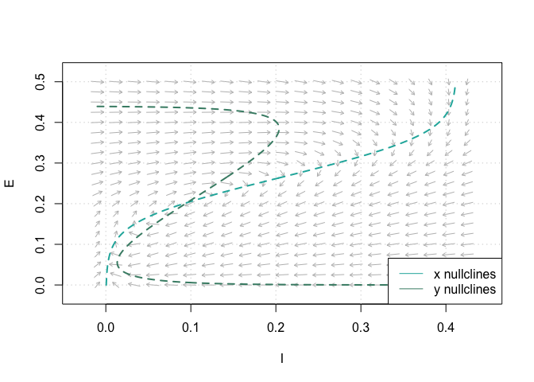
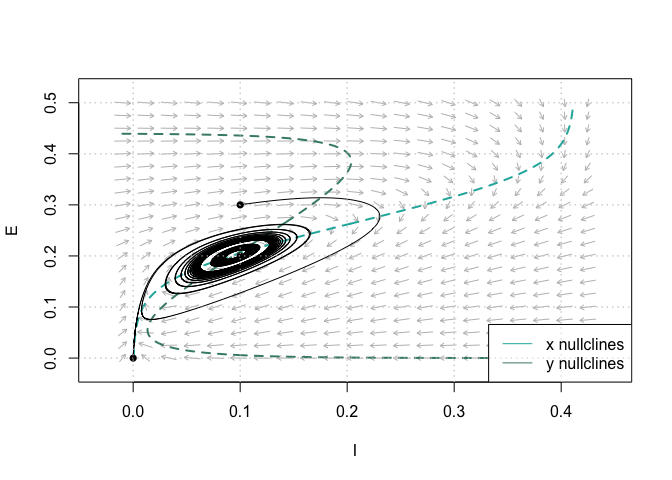
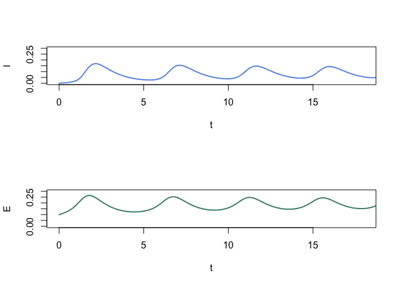

Excitatory and Inhibitory Dynamics of Model Neurons
================
Hannah Luebbering
December 12, 2020

#### Limit Cycles 

Non-linear systems can exhibit a type of behavior known as a limit
cycle. If there is only one steady-state solution, and if the
steady-state solution is unstable, a limit cycle will occur. In the
following, we define the parameters for satisfying conditions 18 and 20
as \(c_1=16\), \(c_2 = 12\), \(c_3=15\), \(c_4=3\), \(a_e = 1.3\),
\(\theta_e=4\), \(a_i=2\), \(\theta_i = 3.7\), \(r_e=1\) and \(r_i=1\).
We can determine a steady-state solution by the intersection of the
nullclines as follows.

Figure 1: Phase Plane Analysis. Determine the steady-state solution by
the nullclines’ intersection. Parameters: \(c_1=16\), \(c_2 = 12\),
\(c_3=15\), \(c_4=3\), \(a_e = 1.3\), \(\theta_e=4\), \(a_i=2\),
\(\theta_i = 3.7\), \(r_e=1\), \(r_i=1\).

In the phase plane, the limit cycle is an isolated closed orbit, where
“closed” means the periodicity of movement, and “isolated” means the
limit of motion, where nearby trajectories converge or deviate. We can
alter our initial values of \(E_0\) and \(I_0\) to obtain different
paths in the phase space.

Figure 2: Phase Plane Analysis showing limit cycle trajectory in
response to constant simulation \(P=1.25\). Dashed lines are nullclines.
Parameters: \(c_1=16\), \(c_2 = 12\), \(c_3=15\), \(c_4=3\),
\(a_e = 1.3\), \(\theta_e=4\), \(a_i=2\), \(\theta_i = 3.7\), \(r_e=1\),
\(r_i=1\).

The phase plane analysis illustrates a bounded steady-state solution
that is classified as unstable; this is a typical feature of a limit
cycle. The solution’s oscillating behavior, shown in Figure 10, follows
typical limit cycle behavior:

i. Trajectories near the equilibrium point are
pushed further away from the equilibrium.

ii. Trajectories far from the equilibrium point
move closer toward the equilibrium.

We established the resting state \(E=0, I=0\) to be stable in the
absence of an outside force. Therefore, the neural population only
exhibits limit cycle activity in response to a constant external input
(P or Q). All in all, the premise of Theorem 3 is that there is only one
steady-state, and it must be near the inflection point for a limit cycle
to exist. Therefore, if we study the limit behavior as a function of
\(P\), where \(Q=0\), then it follows that:

  - There is a threshold value of P, and below this threshold, the limit
    cycle activity cannot occur.
  - There is a higher value of P, and above this bound, the system’s
    limit cycle activity will cease.
  - Within the range defined above, both the limit cycle frequency and
    the average value of \(E(t)\) increases monotonically with respect
    to \(P\).

 

Figure 3: \(I(t)\) and \(E(t)\) for limit cycle shown in Fig. 9. The
limit cycle depends on the value of \(P\), i.e. \(Q\) being set equal to
zero.

